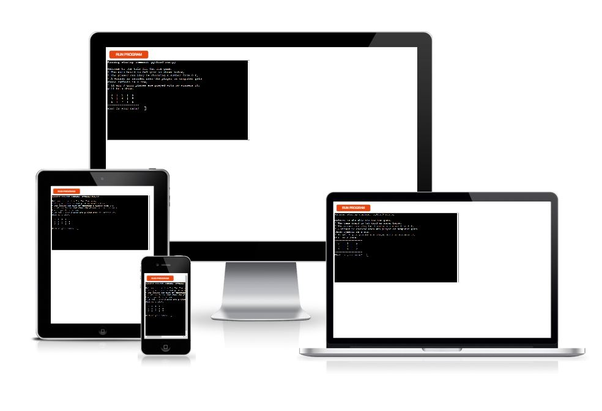
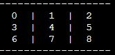

# Tic Tac Toe Game

# How to play

* The game board is 3x3 grid as shown below,
* The player can play by choosing a number from 0-8,
* A winner is decided when the player or computer gets
three symbols in a row,
* If all 9 grid places are played with no winners it,
will be a draw.

# Features 

## Computer
Play against computer 
The computer generates a random number between 1 and 8 to play

## Score keeping
After the player or computer wins, the number of wins is recorded and displayed.

# Testing

## Credits

#### Content
- For the Python, I got some ideas from Sentdex on Youtube

#### Media
- 
