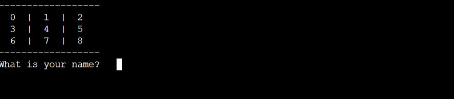
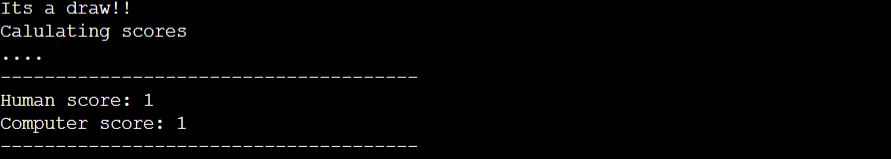
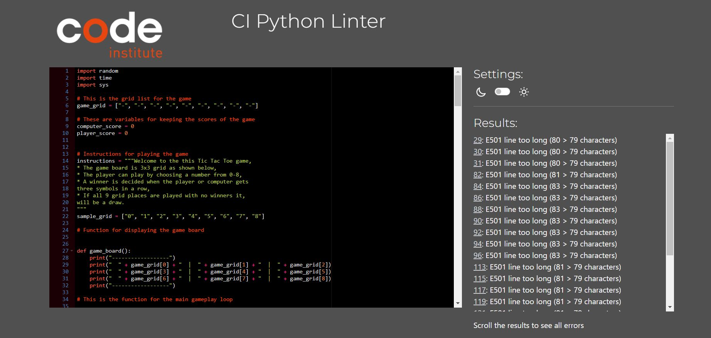
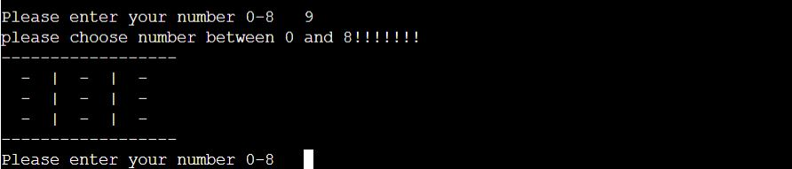
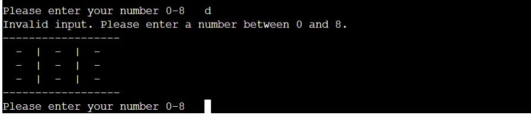

# Tic Tac Toe Game

(Not currently deployed)

 

 

## Table of Contents  

 

- [About](#about) 
- [How to play](#how-to-play)  
- [Ux](#ux)  
- [Features](#features)  
- [Testing](#testing)  
- [Exception and Error handling](#exception-and-error-handling)
- [Bugs](#bugs)  
- [Deployment](#deployement)  
- [Credits](#credits)  

 

------------

 

## About

 

[Link to live game](https://tic-tac-toe-terminal.herokuapp.com/)

 

This Tic Tac Toe game is a classic two-player game where the player competes against the computer. The game board is a 3x3 grid, and the objective is to place three of your markers (either "X" or "O") in a row, column, or diagonal before the computer does

In this particular version of the game, the computer opponent chooses its moves randomly on the board, providing an unpredictable challenge for the player. The game is played entirely through the terminal, with the player and computer taking turns placing their markers on the board.

 

-------------

 

## How to play

 

* The game board is 3x3 grid as shown below,
* The player can play by choosing a number from 0-8,
* A winner is decided when the player or computer gets
three symbols in a row. This can be horizontally, vertically or diagnoal
* If all 9 grid places are played with no winners it,
will be a draw.

 

 

-------------

 

## Ux

 

### Website goals

 

- Give insturctions about the game and how to play.
- Provide the user with  an easy to play tic tac toe game against computer.
- Provide up to date score keeping.
- Allow user to play again.

 

### User goals

 

- The goal of this program is to play a game of Tic Tac Toe against the computer who plays randomly on the board.
- Easily navigate the inputs and instructions.

 

--------

 

## Features 

 

### Computer

 

- The player plays against the computer. 
- The computer generates a random number between 1 and 8 to play.

 

### Winning game

 

- When the player/computer gets three symbols in a row, the game ends.

 

 

### Draw game 

 

- If all the board has been played with no winner, it is declared a draw

 

### Score keeping

 

- After the player or computer wins, the number of wins is recorded and displayed. One point is added for a win. A draw is one point each.

 

 

### Reset game

 

- he player can reset the game and play again. This clears the gameboard and allows the game to be played again.

 

----------

 

## Testing

 
I have tested the game with the following:

 

- It passed through CI Python Linter with no major issues. I left the "line too long" errors as they dont affect readability

 

 

- I tested the game in vscode terminal and on Heroku.

 

- I tried playing invalid grid numbers and inputs while playing the game.

 

---------------

 

## Exception and error handling:

 

- If the user doesnt enter an integer(0,8) to play the board, they recieve the following prompt:

 

 

- If the user enters a non interger input to play the board, they recieve the following prompt:

 

 

--------

 

## Bugs 

 

## Solved bugs

 

- I had an issue with some functions not being able to change variables that were declared somewhere else.
However I fixed this with global keyword in the function.

 

-----------------

 

## Deployment 

 

- Sign up/ login to heroku.

- Click on Create App

- Link Heroku app to repository on github.

- Click Deploy.

 

--------

 

## Credits

 

#### Content

 

- For the Python, I got some ideas from Sentdex on Youtube

#### Deployent

 

- Code institute for the terminal deployement

 

------------
